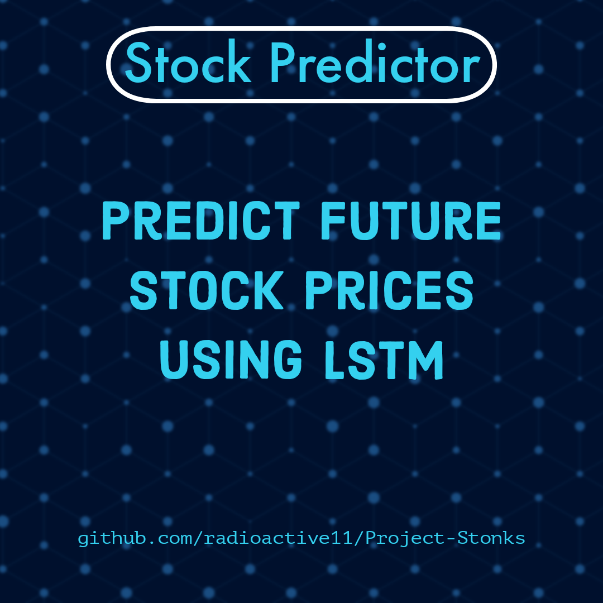

[![Contributors][contributors-shield]][contributors-url] 
[![Forks][forks-shield]][forks-url]
[![Stargazers][stars-shield]][stars-url]
[![Issues][issues-shield]][issues-url]
[![MIT License][license-shield]][license-url]
[![LinkedIn][linkedin-shield]][linkedin-url]


<!-- PROJECT LOGO -->
<br />
<p align="center">
  <a href="https://github.com/othneildrew/Best-README-Template">
    
  </a>

  <h2 align="center">Project Stonks</h>

  <h4 align="center">
  <p align="center">
    Predict next day stock prices with great accuracy
    </h4>
  </p>
</p>


<!-- TABLE OF CONTENTS -->
## Table of Contents

- [Table of Contents](#table-of-contents)
- [About The Project](#about-the-project)
  - [Built With](#built-with)
- [Getting Started](#getting-started)
  - [Installation](#installation)
- [Usage](#usage)
- [Roadmap](#roadmap)
- [Contributing](#contributing)
- [License](#license)
- [Contact](#contact)


<!-- ABOUT THE PROJECT -->
## About The Project


The project aims to predict the stock prices of a given company using LSTM networks. It can be beneficial / it can come handy in following ways-

*	Predicting the future performance of a certain stock thereby allowing you to decide the positions you want to take ie to sell, buy or hold.
*	Selecting the industry for investment by studying the expected industry-wise market trends.
*	Acting as a tool to confirm your analysis about the movement of stock prices.
The results should not be treated as conclusive for investment and do not ensure a 100% accuracy.<br/><br/>
However, the minimum accuracy of the model is 86% which is taken to be acceptable considering the unpredictable nature of the stock market.


### Built With

* [TensorFlow](https://www.tensorflow.org/)
* [Python](https://www.python.org/)


<!-- GETTING STARTED -->
## Getting Started

You will need Python (>3.6), TensorFlow2 to run this. <br/>
Installation of required packages is covered under ```installation``` </br>
To get a local copy up and running follow these simple example steps.


### Installation

1. Make sure you have python3 setup on your system
2. Clone the repo
```sh
git clone https://github.com/radioactive11/Project-Stonks
```
3. Install requirements
```sh
pip install -r requirements.txt
```
4. Open terminal and enter
```
python3 main.py
```


<!-- USAGE EXAMPLES -->
## Usage

Enter the company ticker you want the prediction for.<br />
_For example_<br />

![product-screenshot]


<!-- ROADMAP -->
## Roadmap

See the [open issues](https://github.com/radioactive11/Project-Stonks/issues) for a list of proposed features (and known issues).


<!-- CONTRIBUTING -->
## Contributing

Contributions are what make the open source community such an amazing place to be learn, inspire, and create. Any contributions you make are **greatly appreciated**.

1. Fork the Project
2. Create your Feature Branch (`git checkout -b feature/AmazingFeature`)
3. Commit your Changes (`git commit -m 'Add some AmazingFeature'`)
4. Push to the Branch (`git push origin feature/AmazingFeature`)
5. Open a Pull Request


<!-- LICENSE -->
## License

Distributed under the MIT License. See `LICENSE` for more information.


<!-- CONTACT -->
## Contact

Arijit Roy - [@this_is_radioactive11](https://www.instagram.com/this_is_radioactive11/) <br />
Project Link: [https://github.com/radioactive11/Project-Stonks](https://github.com/radioactive11/Project-Stonks)


[contributors-shield]: https://img.shields.io/github/contributors/radioactive11/Project-Stonks.svg?style=flat-square
[contributors-url]: https://github.com/radioactive11/Project-Stonks/graphs/contributors
[forks-shield]: https://img.shields.io/github/forks/radioactive11/Project-Stonks.svg?style=flat-square
[forks-url]: https://github.com/radioactive11/Project-Stonks/network/members
[stars-shield]: https://img.shields.io/github/stars/radioactive11/Project-Stonks.svg?style=flat-square
[stars-url]: https://github.com/radioactive11/Project-Stonks/stargazers
[issues-shield]: https://img.shields.io/github/issues/radioactive11/Project-Stonks.svg?style=flat-square
[issues-url]: https://github.com/radioactive11/Project-Stonks/issues
[license-shield]: https://img.shields.io/github/license/radioactive11/Project-Stonks.svg?style=flat-square
[license-url]: https://github.com/radioactive11/Project-Stonks/blob/master/LICENSE.txt
[linkedin-shield]: https://img.shields.io/badge/-LinkedIn-black.svg?style=flat-square&logo=linkedin&colorB=555
[linkedin-url]: https://linkedin.com/in/arijit--roy
[product-screenshot]: images/screenshot.png
[product-post]: images/post.png
